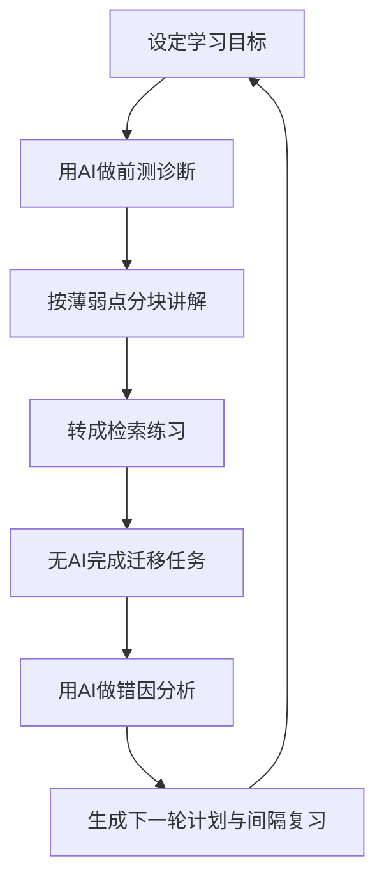

# AI辅助学习的实证评估与个人实践指南

## 执行摘要

过去五年的证据指向一个并不“炫技”的结论：**AI对学习最有价值的形态，不是替你完成学习，而是把学习过程结构化、个性化、可反馈化**。当AI以“答题机”“代写机”的形式直接给结论时，短期表现常常上升，但长期迁移与脱机表现可能下降；当AI以“护栏化 tutor（分步引导、追问、即时反馈、来源约束）”的形式出现时，学习增益更稳健。Bastani 等人在高中数学的大规模现场实验中发现，普通 GPT 界面显著提高练习表现，却在撤去 AI 后让学生考试表现下降；而加入护栏的 GPT Tutor 明显缓解了这种副作用。与之相呼应，哈佛大学物理课程的随机对照试验显示，**按学习科学原则精心设计**的 AI tutor 能让学生在更短时间内获得更高学习增益，并提高投入感与动机。citeturn9search5turn35view0

对个人学习者而言，**最值得落地的 AI 用法**主要有四类：其一，诊断你“不会的具体点”；其二，把材料转成检索练习、例题、反例和迁移题；其三，对你的错误做“误差分析”；其四，在大量资料中做来源约束的整理与比对。与之相对，**最不该外包给 AI 的环节**是：最终理解是否成立、关键概念能否脱机回忆、能否迁移到新任务，以及最终成品是否代表你自己的判断。这个判断既来自生成式 AI 在教育中的风险研究，也来自更早的学习科学：高效学习靠检索练习、间隔复习与自我解释，而不是被动重读和被动摘要。citeturn36view0turn37view0turn14search0turn13search8turn15search2turn15search8

工具选择上，**不要按“模型名气”选，而要按“任务结构、来源可追溯性、隐私边界、成本”选**。做资料理解与考试复习，NotebookLM 这类“基于你上传资料、带引用”的工具通常比通用聊天更稳妥；做开放网络检索，Perplexity 与 Gemini/ChatGPT 的联网功能更高效，但要额外核对来源；做学术研究起步，Consensus 之类工具比普通聊天更适合“先找论文，再读原文”；做编程学习，GitHub Copilot/Cursor 的价值主要在“解释、补全、审查、重构”，而不在“整题代做”。同时，消费级产品的数据使用政策差异很大：OpenAI、GitHub 等个人产品默认或可默认使用交互数据改进模型，通常需要用户主动关闭；NotebookLM 明确说明你的 notebook 数据默认不用于训练；Cursor 提供 Privacy Mode；Perplexity 对企业/API 有更明确的不训练承诺，但个人版公开承诺相对没有企业版那样清晰。citeturn16search0turn24search0turn20search2turn20search8turn20search16turn28search0turn28search4turn19search0turn19search1turn23search1

因此，最实用的策略不是“全面 AI 化”，而是建立一个**人主导、AI增效、结果可验证**的学习回路：先用 AI 帮你拆目标和暴露盲点，再用 AI 生成检索题与迁移题，接着以无 AI 条件完成回忆与应用，最后再用 AI 做错因分析与下一轮计划。这份报告的核心建议、工具清单和 30 天试验方案，都围绕这个原则展开。citeturn36view0turn37view0turn30view0turn43view0

## 核心学术与权威证据综述

从证据结构看，近五年关于 AI 辅助学习的研究可以分成三类。第一类是**系统综述与元综述**，用于回答“AI 在教育里大体做了什么、证据强弱怎样、缺口在哪里”；第二类是**随机对照或现场实验**，用于回答“具体设计是否真的提升学习”；第三类是**官方/国际组织指南**，用于回答“应该怎样负责任地落地”。三类证据合起来呈现出较清晰的图景：AI 确实能提高反馈的即时性、练习的个性化和学习材料的适配性，但**长期学习效果高度依赖设计护栏、来源可靠性和人类自我调节能力**。citeturn40view0turn41view0turn35view0turn9search5turn30view0turn43view0

| 论文/报告 | 来源类型 | 关键结论 | 适用场景 | 可信度 | 原始URL |
|---|---|---|---|---|---|
| Zawacki-Richter et al., 2019, *Systematic review of research on artificial intelligence applications in higher education* | 学术 | 回顾 2007–2018 年 146 篇研究，归纳出四类主要应用：画像/预测、评估、个性化/自适应、智能辅导；同时指出教育学视角与伦理反思明显不足。citeturn40view0 | 作为理解 AIED 全景的奠基综述，适合建立“AI 不只是聊天机器人”的基本框架 | 高 | `https://link.springer.com/article/10.1186/s41239-019-0171-0` |
| Mustafa, 2024, *A systematic review of literature reviews on AIED* | 学术 | 这是一篇“综述的综述”，指出 AIED 研究快速扩张，但场景、方法、目标都很分散；未来需要更强的伦理、跨学科与长期效果研究，并强调生成式 AI 的教育影响仍需进一步检验。citeturn41view0 | 适合把握“研究很多，但不等于结论稳定”的证据边界 | 高 | `https://link.springer.com/article/10.1186/s40561-024-00350-5` |
| U.S. Department of Education, 2023, *Artificial Intelligence and the Future of Teaching and Learning* | 官方 | 报告强调 AI 既可能提升适应性支持与资源定制，也会带来隐私、安全、算法歧视、监控与过度信任问题，并明确反对“AI 替代教师”的思路。citeturn30view0turn31view0 | 适合用来建立风险意识与“人类在环”原则 | 高 | `https://www.ed.gov/sites/ed/files/documents/ai-report/ai-report.pdf` |
| UNESCO, 2023, *Guidance for generative AI in education and research* | 官方 | UNESCO 提出以人为中心的框架，强调数据隐私保护、年龄限制、伦理验证与教学设计，并指出多数国家监管尚未跟上生成式 AI 发展。citeturn43view0 | 适合建立个人使用的底线：先问边界、再谈效率 | 高 | `https://www.unesco.org/en/articles/guidance-generative-ai-education-and-research` |
| UNESCO, 2025, *AI and education: protecting the rights of learners* | 官方 | 强调生成式 AI 会引入偏见、刻板印象、歧视、隐私与治理风险，要求从学习者权利角度审视 AI 采用。citeturn4search15turn32search1 | 适合处理未成年人、考试、敏感数据等高风险场景 | 高 | `https://unesdoc.unesco.org/ark:/48223/pf0000395373.locale=en` |
| Bastani et al., 2025, *Generative AI without guardrails can harm learning* | 学术 | 近千名高中生数学现场实验显示：GPT Base 让练习表现提高 48%，GPT Tutor 提高 127%；但撤去 AI 后，GPT Base 组考试成绩比对照组低 17%，而带护栏的 GPT Tutor 基本消除了这一伤害。citeturn9search5 | 适合回答“为什么不能把通用聊天当私人家教” | 很高 | `https://hamsabastani.github.io/education_llm.pdf` |
| Kestin et al., 2025, *AI tutoring outperforms in-class active learning* | 学术 | 哈佛物理随机对照试验中，AI tutor 组在更短时间内获得更大的学习增益，学生也报告更高的投入感和动机；作者强调收益来自研究型教学设计，而不是“有 AI 就行”。citeturn35view0 | 适合说明“AI tutor 是否可能有效” | 很高 | `https://www.nature.com/articles/s41598-025-97652-6` |
| Lan & Zhou, 2025, *AI empowered self-regulated learning* | 学术 | 综述发现，AI 对自我调节学习三阶段的支持并不平衡：多数工具主要支持“执行阶段”，较少完整支持“目标设定—执行—反思”的全循环；同时会出现反馈不准、过度依赖等问题。citeturn36view0 | 适合设计个人学习流程，而不是只看工具功能 | 高 | `https://www.nature.com/articles/s41539-025-00319-0` |
| Guan et al., 2025, *How educational chatbots support self-regulated learning* | 学术 | 27 篇研究的系统综述表明，教育聊天机器人主要擅长资源定位、策略执行和元认知监控；对目标设定、长期计划、反思与迁移的支持仍不充分，效果也有混合结果。citeturn37view0 | 适合提醒个人学习者：聊天机器人能帮很多，但不等于完整学习系统 | 高 | `https://link.springer.com/article/10.1007/s10639-024-12881-y` |
| Létourneau et al., 2025, *AI-driven ITS in K-12 education* | 学术 | 系统综述 28 项 K-12 研究发现，ITS 对学习和表现总体偏正向，但与非智能系统比较时优势会减弱；研究多为短期、样本较小、STEM 偏多，伦理问题在研究中几乎未被充分讨论。citeturn38view0 | 适合看懂“ITS 有效，但别夸大到万能” | 高 | `https://www.nature.com/articles/s41539-025-00320-7` |

如果把这些研究放在一起看，个人学习者最该记住三件事。第一，**AI 的最佳价值在于“即时反馈 + 个性化节奏 + 结构化支架”**，而不是一次性交答案。第二，**证据对“短期练习表现提升”比对“长期迁移与独立能力提升”更乐观**，所以必须设置无 AI 检验。第三，**真正稳健的方案不是单一模型，而是学习科学与工具设计的结合**。citeturn35view0turn9search5turn36view0turn37view0

作为更早的基础文献，Bloom 的“2 Sigma 问题”指出一对一辅导能把平均学生推进到远高于常规课堂的水平；VanLehn 则证明某些分步型智能辅导系统在特定条件下可以逼近人类辅导。今天生成式 AI 之所以值得关注，本质上不是因为它“会说话”，而是因为它让**大规模、低边际成本的个性化支架**变得更可行。citeturn11search5turn11search0

## 面向个人的可实用工具与平台清单

对个人学习者来说，工具不应按“最强模型”排序，而应该按**工作流位置**排序。你通常需要四类工具：通用问答与解释工具、基于资料的来源约束工具、研究检索工具、特定学科/任务工具。下表把最常见的可落地工具放在同一坐标系里比较。表中的“可信度”指**本行信息的可核验度**，不是对产品能力的绝对评价。citeturn20search0turn16search0turn23search5turn17search21turn18search18turn19search0

| 工具 | 主要用途 | 主要优点 | 主要缺点 | 隐私/数据风险 | 成本/免费策略 | 适合人群 | 可信度/来源类型 | 原始URL |
|---|---|---|---|---|---|---|---|---|
| ChatGPT | 通用解释、分步问答、练习生成、错误分析 | 有专门的 Study Mode，可按目标和水平分步追问；免费层即可用，Plus 提升配额与能力。citeturn20search1turn20search3turn20search18 | 通用模式仍可能直接给答案；联网/文件分析并不等于来源审查；若用户不自检，容易形成“看懂错觉”。citeturn20search1turn9search5turn35view0 | 个人版对话默认可能用于改进模型，但可在 Data Controls 中关闭；上传文件也受同类数据控制约束。citeturn20search2turn20search8turn20search10turn20search16 | 免费可起步；Plus 为 `20 USD/月`，适合高频使用。citeturn20search0turn20search3 | 通用学习者、考前复习、概念理解 | 高 / 官方帮助与产品页 | `https://help.openai.com/en/articles/11780217-chatgpt-study-mode-faq` |
| NotebookLM | 资料消化、考试复习、课程笔记、来源约束问答 | 以你上传的资料为边界，回答附引用；可自动生成 study guides、FAQ、flashcards、audio overview。citeturn27search6turn27search10turn27search4 | 不擅长开放世界探索；对资料质量高度敏感；若源材料本身错，答案也会被“稳稳地错”。citeturn27search6turn27search10 | 官方说明 notebook 数据默认不用于训练，除非你主动反馈。citeturn16search0turn27search12turn27search14 | Gmail 账户可免费使用；Google AI 计划提高限额。citeturn27search1 | 课程学习、论文阅读、政策/教材消化 | 很高 / 官方帮助与博客 | `https://support.google.com/notebooklm/answer/16213268?hl=en` |
| Gemini | 通用问答、与 Google 生态协同、学习型任务 | Gemini 可处理写作、计划、脑暴；Google AI Pro 宣传其适合学习，并与 NotebookLM、Gmail/Docs 联动。citeturn29search3turn29search4turn29search6 | 对开放问题仍需核查来源；不同套餐、地区和功能可用性变化较快。citeturn29search0turn29search10 | Gemini Apps 隐私说明披露会处理活动数据；企业/教育版有更强的数据保护承诺。citeturn16search20turn16search15turn16search18 | 免费版可用；Google AI Pro/Ultra 提供更高限额与 NotebookLM 高级功能。citeturn29search0turn29search10 | 已深度使用 Google 生态的学习者 | 高 / 官方产品页与帮助页 | `https://gemini.google.com/` |
| Claude | 长文解释、推理、写作辅导、资料整理 | 长上下文与解释能力强；Anthropic 在教育方案里明确提出“learning mode/思维引导”理念。citeturn21search1turn21search9turn21search5 | 面向普通个人用户时，教育型“learning mode”并非所有人都可直接获得；价格与容量分层复杂。citeturn22search0turn22search1 | 企业/教育方案默认承诺不在你的内容上训练；个人版公开页面相对更强调套餐与帮助，而不是像 Enterprise 那样给出完整治理承诺。citeturn22search0 | Free 可试；Pro `20 USD/月`，更高用量有 Max。citeturn22search1turn22search4 | 需要长文推理、论文解释、深度讨论者 | 高 / 官方产品页、帮助页、行业报告 | `https://www.anthropic.com/pricing` |
| Perplexity | 开放网络调研、快速搜集来源、时效性问题 | 主打带内联引用的网络答案，对“先搜后读”非常高效；免费可用，Pro 提升模型与研究能力。citeturn23search3turn23search5turn2search20 | 引用质量依赖检索与页面质量，不等于学术审稿；对复杂主题仍可能“拼装正确语气、未必拼装正确论证”。citeturn23search5 | 企业版公开承诺不训练数据；API 有 zero data retention；个人 Pro 的同等级公开承诺没有企业版那么明确。citeturn23search1turn24search0 | 核心搜索免费；Pro 为 `20 USD/月`；更高阶企业/Max 更贵。citeturn2search20turn23search1 | 资讯调研、开题摸底、跨来源比对 | 高 / 官方产品页与文档 | `https://www.perplexity.ai/hub` |
| Consensus | 学术论文检索与“先看研究结论再回原文” | 明确定位为基于同行评议文献的学术搜索；每个回答可回溯到论文。citeturn17search4turn17search21 | 适合“找证据”，不适合替代通读论文；对中文资料和非论文材料覆盖不足。citeturn17search21 | 官方帮助中心称不使用用户数据训练任何 AI 模型。citeturn17search3turn17search0 | 可免费注册；有 Pro/Deep 付费层，Deep 公开价 `65 USD/月`。citeturn17search24turn17search1 | 学术研究者、论文写作者、循证学习者 | 高 / 官方产品页与帮助页 | `https://consensus.app/search/` |
| GitHub Copilot | 编程学习、代码解释、调试、重构 | 已有 Free 与个人付费层；适合边写边学、看示例、问“为什么报错”。citeturn18search18turn28search7turn28search17 | 容易让初学者直接接受整段代码而不理解；官方也强调要检查输出。citeturn28search2turn28search9 | 从 2026-04-24 起，个人 Free/Pro/Pro+ 交互数据可被 GitHub 用于训练和改进模型，需用户主动 opt out；Business/Enterprise 不受该变更影响。citeturn28search0turn28search4 | Free 可上手；Pro `10 USD/月` 起。citeturn18search12 | 编程学习者、开发者 | 很高 / 官方文档与博客 | `https://github.com/features/copilot` |
| Cursor | 编程深度协作、代码库级理解、Agent 式任务 | 对大项目、重构和代码库理解常比通用聊天顺手；提供 Privacy Mode。citeturn19search0turn19search1 | 学习者容易把它当“全自动写作器”；价格与用量规则变化相对频繁，成本可失控。citeturn18search1turn18search5 | Privacy Mode 开启后，官方称不会拿你的数据训练；但云端 Agent/团队功能使数据边界更复杂，适合在理解后再用。citeturn19search1turn19search16turn19search18 | 有免费/Pro/Team；Team 公布价 `40 USD/用户/月`。citeturn18search1turn19search9 | 中高级编程学习者 | 高 / 官方产品页与安全页 | `https://cursor.com/data-use` |
| Duolingo | 语言学习、口语练习、角色扮演、日常坚持 | 核心课程免费；AI 功能把对话练习做成 Video Call / Roleplay 等更接近真实互动。citeturn3search3turn3search7turn3search23 | 更擅长高频轻量训练，不适合替代系统语法、阅读与真实输出；套餐变化较快。citeturn3search19 | 采用常规平台隐私政策；属于高频交互型学习应用，适合少放敏感内容。citeturn18search3 | 免费能长期用；AI 功能位于付费层，且 2026 年功能/套餐仍在调整。citeturn3search3turn3search19 | 外语学习者、口语练习者 | 中高 / 官方帮助、博客、投资者材料 | `https://www.duolingo.com/help/what-is-duolingo-max` |

如果只给出一个**最低成本、最高可操作性**的组合，我会建议：**NotebookLM + 一个通用聊天工具 + 一个间隔复习工具**。具体来说，可以用 NotebookLM 消化资料、用 ChatGPT/Gemini/Claude 做讲解与纠错、再把关键点手工或半自动转入 Anki/Quizlet 这类间隔复习系统。原因很简单：研究反复显示，真正稳定的学习收益来自检索与间隔，而不是单次解释本身。citeturn27search4turn14search0turn13search8turn15search8

如果预算中等且重视“学习而不是纯效率”，我会倾向于把钱花在**来源约束能力或高频练习能力**上，而不是单纯更大的模型上下文。对多数人而言，NotebookLM 的 premium 限额、ChatGPT Plus、Claude Pro、Perplexity Pro 这类投入，比盲目订阅多个“最强模型”更容易转化为真实学习收益。citeturn27search1turn20search3turn22search1turn2search20

## 可操作的方法与学习流程

把 AI 真正用成“学习器”而不是“代工厂”，关键不是某个神奇 prompt，而是学习流程。结合自我调节学习研究、检索练习研究、间隔复习研究，以及近两年的 AI tutor 实验，我建议个人学习者采用一个**六段式回路**：目标设定、诊断、讲解、检索、迁移、反思。这样做的原因在于，现有 AI 工具最擅长支持“执行中的反馈与解释”，而学习成败却常取决于“前端目标”和“后端反思/迁移”，这两端需要你主动补足。citeturn36view0turn37view0turn14search0turn13search8turn15search2turn35view0turn9search5



在操作层面，你可以这样执行：

1. **先写目标，不先开聊天框。**  
   目标不要写成“学会机器学习”，而要写成“能在 10 分钟内解释偏差—方差权衡，并独立完成 3 道迁移题”。自我调节学习研究表明，目标设定和计划阶段本来就是多数 AI 工具支持不足的部分，所以这一步必须由你先给出清晰约束。citeturn36view0turn37view0

2. **用 AI 做诊断，不做总代学。**  
   让 AI 先给你一个小型前测：概念题、例题、反例题各一到两题，并要求它“在你作答前不要解释答案”。这样比一上来听长篇解释更能暴露真实薄弱点，也更符合检索练习优先于被动重读的证据。citeturn14search0turn15search8

3. **讲解只针对薄弱点，且要求分步。**  
   对每个不会点，只让 AI 解释一个概念或一个步骤，并要求它给出“错误原因—正确思路—一题微练习”的三联结构。Bastani 的研究说明，没有护栏的直接回答容易把学生推向“拐杖式使用”；Kestin 的研究则说明，按研究型教学原则设计的分步支架更有效。citeturn9search5turn35view0

4. **把解释立刻转成检索。**  
   让 AI 把刚讲过的内容转成短答题、是非辨析题、类比题和迁移题；然后在**不看答案、不看聊天记录**的情况下作答。检索练习与间隔复习，是学习科学中证据最稳的高效技术之一。citeturn14search0turn13search8turn15search8

5. **每个学习单元都要有一次“无 AI 迁移任务”。**  
   比如：编程时独立写一个稍变形的小程序；语言学习时独立写 150 字短文或录 2 分钟口语；学术研究时独立写一个问题框架和证据链。AI 能否帮你理解，不如“离开 AI 后你还能不能做”更重要。citeturn9search5

6. **最后再开 AI 做错因分析和下一轮计划。**  
   给 AI 你的错误答案、卡顿点、完成时长和主观难度，让它只做三件事：分类型归因、提出下一轮练习、建议间隔复习时间点。这样 AI 是“分析器”和“计划器”，而不是“替身”。citeturn36view0turn37view0

下面这组模板，比“万能神 prompt”更实用，因为它把 AI 的角色限制在对学习有益的位置上：

```text
模板一：前测诊断
你现在是学习诊断助手，不要先解释。
主题：{主题}
目标：{我希望在什么情境中独立完成什么任务}
请先给我：
1）2道概念题
2）2道易错辨析题
3）1道迁移题
等我作答后，再按“错误点-原因-最小修正”反馈。
```

```text
模板二：分步讲解
请不要直接给结论。
我在 {题目/概念} 上卡住了。
请按以下顺序输出：
1）先问我一个澄清问题
2）只解释当前这一步，不扩展到下一步
3）给我一个5分钟内能完成的微练习
4）等我回答后再继续
```

```text
模板三：检索练习生成
把这段内容转成：
- 5道短答检索题
- 3道反例/辨析题
- 2道跨情境迁移题
要求：不要附答案；我答完后你再按评分标准批改。
内容：{笔记/教材片段/我自己的总结}
```

```text
模板四：错因分析
以下是我的答案、正确答案、以及我花的时间。
请只做：
1）把错误归为“概念不清 / 提取失败 / 迁移失败 / 粗心执行”
2）每类给1个修正动作
3）生成明天、三天后、七天后的复习任务
不要重写整份答案。
```

不同学科要把 AI 放在不同位置。对**编程学习**，最重要的是让 AI“解释 bug、比较方案、出变式练习”，而不是“整题生成”；对**语言学习**，最重要的是让 AI“陪练输出、纠错、生成情境”，而不是“替你写作文”；对**学术研究**，最重要的是让 AI“找来源、做提纲、比对争议”，而不是“代替你形成结论”。研究综述与实验都说明，AI 更适合做支架和反馈，不适合吞掉完整学习过程。citeturn37view0turn36view0turn35view0turn9search5

为了让流程可衡量，我建议至少追踪四个指标：**保留率**（一周后还能答对多少）、**迁移率**（新题/新情境成功率）、**独立完成率**（无 AI 条件下能否完成任务）、**依赖度**（每完成一题/一段内容需要多少次 AI 干预）。这些指标比“今天用了几个模型、做了多少漂亮摘要”更反映真实学习效果。citeturn14search0turn13search8turn36view0

## 常见误区、风险评估与反例分析

最常见的误区，是把“看懂”误认为“学会”。在学习科学里，这种错觉并不新鲜：学生常常高估重读、划线、看别人讲解的效果，而低估检索练习与间隔复习。AI 时代只是把这种错觉放大了，因为它能用极其流畅的语言制造“我已经理解”的感觉。Karpicke 与 Blunt 证明检索练习比概念图式的精加工更有效；Dunlosky 的综述也把 practice testing 和 distributed practice 评为高效技术。citeturn14search0turn15search2turn15search8

第二个误区，是把“练习时做得更快”误认为“独立能力更强”。Bastani 的现场实验恰好说明了这个陷阱：普通 GPT 界面能抬高做题时的表现，但在撤去 AI 后削弱独立考试表现。也就是说，**AI 可能提高生产率，却不一定提高人本身的能力存量**。如果你的学习流程没有“无 AI 检验”，你很容易把“与 AI 协同能完成”误判为“我自己已经会了”。citeturn9search5

第三个风险，是**反馈看似合理但实际不准**。Lan & Zhou 的综述指出，AI 反馈的准确性和一致性是重要问题；Guan 等人的综述也发现，聊天机器人对于完整 SRL 周期的支持不足，且效果常常混合。这意味着：AI 的解释必须被看作“候选解释”，而不是“最终解释”。对高风险学习任务，最好优先使用来源约束工具，或要求 AI 明确引用你的资料与原文。citeturn36view0turn37view0

第四个风险，是**偏见、监控与隐私外溢**。美国教育部报告强调，AI 可能带来新的数据隐私、安全、算法歧视与过度监控风险；UNESCO 也明确要求在教育与研究中以学习者权利、年龄适配和数据保护为前提。对于个人学习者，这意味着不要把未公开论文、公司内部项目、真实病历、敏感个人信息、未提交作业原件等一股脑丢进消费级工具。citeturn30view0turn31view0turn43view0turn4search15

下面这些“看上去很美”的主张，尤其值得警惕：

| 夸大主张/不可行做法 | 为什么不可行 | 更可行的替代方案 | 证据 |
|---|---|---|---|
| “让 AI 给我总结完教材，我就算学会了。” | 被动摘要不能替代检索与迁移，容易形成理解错觉。 | 先自己写 5 句总结，再让 AI 挑漏洞、出检索题。 | citeturn14search0turn15search8 |
| “通用聊天机器人就等于私人家教。” | 通用模式可能直接给答案，短期高分但长期伤学习；真正有效的是有护栏、分步、研究型设计的 tutor。 | 只在分步模式使用，或用 Study Mode/NotebookLM/定制 tutor。 | citeturn9search5turn35view0turn20search1turn16search0 |
| “AI 查到一堆引用，所以我不用读原文了。” | 引用存在检索噪音、断章取义或二次摘要偏差；研究综述强调伦理与方法仍需审慎。 | 先用 Consensus/NotebookLM/Perplexity 找线索，再回原文核 3 篇关键来源。 | citeturn17search21turn27search10turn23search5turn41view0 |
| “编程学习就直接让 AI 把整题写完。” | 初学者容易跳过问题建模与调试思维，形成依赖；官方也强调要检查输出并理解限制。 | 让 AI 只解释 bug、比较两种写法、生成变式题与测试样例。 | citeturn28search2turn28search9turn28search17 |
| “免费/个人版工具都差不多，隐私无所谓。” | 不同平台对训练、保留、企业隔离的承诺差异很大；个人版常弱于企业/教育版。 | 学习资料分级：公开资料上通用工具；敏感资料优先本地、企业版或不上传。 | citeturn20search8turn20search16turn28search0turn28search4turn19search1turn24search0 |

在可解释性上，也要有现实预期。生成式 AI 并不是“知道自己为何这么说”的系统，它输出的是最可能、最顺滑的回答；你要求它“解释自己的推理”，往往得到的是**后验生成的、看似合理的文字**，不等于可靠的过程证据。所以对学习而言，更可靠的做法不是逼 AI“自证正确”，而是让它**给出处、给例题、给反例、给可检验任务**，然后你自己完成验证。citeturn30view0turn36view0

## 我的观点与实践建议

我的总体观点很明确：**AI 辅助学习最适合做“脚手架”，不适合做“替身”**。如果把 AI 当脚手架，你会更快暴露盲点、获得反馈、形成练习回路；如果把 AI 当替身，它会替你完成那些恰恰最应该由你自己做的认知劳动。这个判断并不是价值宣言，而是对现有证据的综合：学习增益来自结构化支架、及时反馈和自我调节，而不是直接代做。citeturn35view0turn9search5turn36view0turn37view0

如果让我给个人学习者排一个优先级，我会这样排序。**最高优先级**是建立“无 AI 基线”和“无 AI 检验”，包括前测、周测和迁移任务；**第二优先级**是优先使用来源约束工具处理教材、论文和讲义；**第三优先级**是把 AI 用在错误分析、练习生成和节奏管理上；**第四优先级**才是追求更强模型、更多 Agent 功能和更长上下文。多数人失败，不是败在模型不够强，而是败在没有把学习流程变成可检验回路。citeturn14search0turn13search8turn16search0turn9search5

短期策略上，我建议先从一个学科、一个工具、一个流程开始。比如你正在学编程，就只试“GitHub Copilot 或 ChatGPT + 本地 IDE + 每天一道无 AI 变式题”；如果你在学语言，就只试“Duolingo/通用聊天 + 每日 5 分钟口语 + 每周一次无 AI 独立输出”；如果你在读论文，就只试“NotebookLM/Consensus + 原文核查 + 自己写结构化摘要”。避免一开始同时订阅三四个工具、做一堆华丽工作流，却没有一个明确指标。citeturn18search18turn20search1turn3search3turn16search0turn17search21

中期策略上，要从“问 AI”升级到“管 AI”。具体而言，就是建立自己的提示模板、错题分类法、资料分级规则和复习节奏。到这一步，AI 不是随叫随到的万能箱，而是你学习系统中的一个标准部件。长期策略上，真正的分水岭不是你会不会用某个模型，而是你有没有形成**AI literacy + learning literacy**：知道什么时候该问，什么时候该停，什么时候必须独立完成，什么时候必须回到原始证据。citeturn21search11turn43view0turn30view0

我特别建议做一个**快速试验设计**：连续两周用 AI 辅助、两周不辅助完全不现实；更好的办法是采用“同主题双任务”设计。比如同一章内容，一半题目允许 AI ，另一半题目强制无 AI；或者学习阶段允许 AI，周测阶段禁止 AI。这样你可以直接比较：练习得分、无 AI 得分、耗时、错误类型、记忆保留率、迁移成功率。Bastani 的研究之所以有说服力，就是因为它同时测了“使用时表现”和“撤去后表现”。个人试验也应如此。citeturn9search5

### 开放问题与局限

现有研究仍有几个限制。第一，很多研究是短期干预，对长期保留、跨课程迁移和元认知成长的证据还不够。第二，高质量随机对照试验仍然少于产品宣传的密度。第三，很多官方产品能力、定价、数据政策更新频繁，本文尽量采用官方页面，但某些细节未来仍可能变化。第四，面向中文环境、成人自学者、跨学科学习项目的高质量实证仍明显不足，这意味着本报告中的部分实践建议是基于多项证据的综合推断，而不是某一篇论文的直接结论。citeturn41view0turn38view0turn20search0turn22search0turn27search1

## 个人30天试验计划

下面给出一个可以直接执行的 30 天方案。它适用于大多数“想把 AI 真正变成学习增效器”的个人学习者，不限具体学科。你只需要选一个主学习主题，例如：Python、概率论、英语口语、论文阅读方法。整个计划默认每天 45–90 分钟。核心原则是：**学习时可用 AI，检验时尽量不用 AI**。citeturn9search5turn14search0turn13search8

| 时间段 | 目标 | 每日动作 | AI 的角色 | 当周输出 |
|---|---|---|---|---|
| 第一天到第三天 | 建立基线 | 做一次前测；写清本月目标；收集教材/资料；建立错题本与指标表 | 只做题目生成与目标澄清，不解释答案 | 一份前测成绩、一份目标说明 |
| 第四天到第十天 | 概念搭建 | 每天一个小主题：前测 10 分钟，分步讲解 15–20 分钟，检索练习 15 分钟，错因分析 10 分钟 | 诊断、讲解、出题、纠错 | 至少 30 道带标签的检索题 |
| 第十一天到第十七天 | 巩固与间隔 | 每天先做旧题回忆，再学新主题；周中做一次无 AI 小测 | 只在测后参与错因分析 | 一次无 AI 小测与复盘报告 |
| 第十八天到第二十四天 | 迁移与应用 | 做跨情境任务：编程写小项目、语言做表达、研究做综述框架 | 只用于拆任务、审查结构、指出漏洞 | 一个可展示的小作品 |
| 第二十五天到第三十天 | 总结与决策 | 做后测；对比前后测；统计依赖度与保留率；决定是否续用/更换工具 | 帮你做数据汇总与下一轮计划 | 一份个人学习实验总结 |

为避免“越学越热闹、越测越心虚”，请把衡量指标提前固定下来。下表的设计目标，不是做学术研究，而是帮你辨别：**AI 到底在帮你学，还是只是在帮你完成任务**。citeturn36view0turn9search5

| 指标 | 定义 | 采集方式 | 建议目标 |
|---|---|---|---|
| 前后测增益 | 后测分数 - 前测分数 | 第一天与第二十八天做同难度测验 | 提升 20% 以上为显著有效 |
| 一周保留率 | 七天后仍能答对的比例 | 从旧题中抽样复测 | ≥ 70% |
| 迁移成功率 | 面对变式题/新情境仍能完成的比例 | 每周一次无 AI 迁移任务 | 持续上升 |
| 独立完成率 | 在无 AI 条件下独立完成任务的比例 | 周测/项目日禁用 AI | 至少不低于前一周 |
| AI 依赖度 | 每完成一题/一段内容所需的 AI 干预次数 | 简单记录“我问了几轮” | 逐周下降 |
| 错误结构变化 | 错误从“概念不清”转向“执行细节” | 错因分类 | 概念类错误占比下降 |
| 时间效率 | 达到相近正确率所需时间 | 定时记录 | 在不牺牲独立完成率前提下下降 |
| 来源核查率 | 关键结论中被你回查原文/原资料的比例 | 对论文、笔记、事实型结论抽样检查 | ≥ 80% |

如果 30 天结束后，你发现“练习时确实更快，但无 AI 周测没有改善”，那就不要继续追加订阅，而应立即调整流程：减少 AI 解释时间，增加无 AI 检索与迁移任务。如果你发现“后测、保留率和迁移率都明显提高，同时依赖度下降”，说明你的 AI 使用方式在真正促进学习，而不只是促进完成。citeturn9search5turn14search0turn13search8

## 完整链接清单

| 来源 | 完整链接 |
|---|---|
| Zawacki-Richter et al. 2019 | `https://link.springer.com/article/10.1186/s41239-019-0171-0` |
| Mustafa 2024 AIED meta-review | `https://link.springer.com/article/10.1186/s40561-024-00350-5` |
| U.S. Department of Education 2023 report | `https://www.ed.gov/sites/ed/files/documents/ai-report/ai-report.pdf` |
| UNESCO 2023 Guidance | `https://www.unesco.org/en/articles/guidance-generative-ai-education-and-research` |
| UNESCO 2025 Learner rights | `https://unesdoc.unesco.org/ark:/48223/pf0000395373.locale=en` |
| Bastani et al. preprint/PDF | `https://hamsabastani.github.io/education_llm.pdf` |
| PNAS version of Bastani et al. | `https://www.pnas.org/doi/10.1073/pnas.2422633122` |
| Kestin et al. 2025 | `https://www.nature.com/articles/s41598-025-97652-6` |
| Lan & Zhou 2025 | `https://www.nature.com/articles/s41539-025-00319-0` |
| Guan et al. 2025 | `https://link.springer.com/article/10.1007/s10639-024-12881-y` |
| Létourneau et al. 2025 | `https://www.nature.com/articles/s41539-025-00320-7` |
| Bloom 1984 | `https://journals.sagepub.com/doi/10.3102/0013189X013006004` |
| VanLehn 2011 | `https://www.tandfonline.com/doi/abs/10.1080/00461520.2011.611369` |
| Karpicke & Blunt 2011 PDF | `https://learninglab.psych.purdue.edu/downloads/2011/2011_Karpicke_Blunt_Science.pdf` |
| Kang 2016 spaced repetition | `https://journals.sagepub.com/doi/10.1177/2372732215624708` |
| Dunlosky et al. 2013 | `https://journals.sagepub.com/doi/10.1177/1529100612453266` |
| ChatGPT pricing | `https://openai.com/chatgpt/pricing/` |
| ChatGPT Study Mode FAQ | `https://help.openai.com/en/articles/11780217-chatgpt-study-mode-faq` |
| OpenAI Data Controls FAQ | `https://help.openai.com/en/articles/7730893-data-controls-faq` |
| OpenAI data use policy | `https://openai.com/policies/how-your-data-is-used-to-improve-model-performance/` |
| NotebookLM upgrade/help | `https://support.google.com/notebooklm/answer/16213268?hl=en` |
| NotebookLM launch/source grounding | `https://blog.google/innovation-and-ai/technology/ai/notebooklm-google-ai/` |
| NotebookLM global features | `https://blog.google/innovation-and-ai/products/notebooklm-goes-global-support-for-websites-slides-fact-check/` |
| NotebookLM student features | `https://blog.google/innovation-and-ai/models-and-research/google-labs/notebooklm-student-features/` |
| Gemini product page | `https://gemini.google.com/` |
| Gemini learning for students | `https://one.google.com/about/articles/google-ai-for-students/` |
| Gemini Apps Privacy Hub | `https://support.google.com/gemini/answer/13594961?hl=en` |
| Google AI plans | `https://one.google.com/about/google-ai-plans/` |
| Claude pricing | `https://www.anthropic.com/pricing` |
| Claude education announcement | `https://www.anthropic.com/news/introducing-claude-for-education` |
| Claude education solution page | `https://www.anthropic.com/solutions/education` |
| Anthropic university student report | `https://www.anthropic.com/news/anthropic-education-report-how-university-students-use-claude` |
| Perplexity hub | `https://www.perplexity.ai/hub` |
| Perplexity Pro | `https://www.perplexity.ai/pro` |
| Perplexity enterprise pricing | `https://www.perplexity.ai/enterprise/pricing` |
| Perplexity privacy & security docs | `https://docs.perplexity.ai/docs/resources/privacy-security` |
| Consensus search | `https://consensus.app/search/` |
| Consensus works/help | `https://help.consensus.app/en/articles/9922673-how-consensus-works` |
| Consensus privacy policy | `https://consensus.app/home/privacy-policy/` |
| Consensus security | `https://help.consensus.app/en/articles/10093291-security` |
| Consensus pricing/help | `https://help.consensus.app/en/articles/10087865-subscription-plans` |
| GitHub Copilot product page | `https://github.com/features/copilot` |
| GitHub Copilot docs | `https://docs.github.com/copilot` |
| GitHub Copilot pricing | `https://docs.github.com/copilot/reference/copilot-billing/models-and-pricing` |
| GitHub Copilot individual pricing | `https://docs.github.com/copilot/concepts/billing/usage-based-billing-for-individuals` |
| GitHub Copilot data usage policy update | `https://github.blog/news-insights/company-news/updates-to-github-copilot-interaction-data-usage-policy/` |
| GitHub Copilot opt-out controls | `https://docs.github.com/copilot/how-tos/manage-your-account/managing-copilot-policies-as-an-individual-subscriber` |
| Cursor pricing | `https://cursor.com/pricing` |
| Cursor data use | `https://cursor.com/data-use` |
| Cursor security/privacy mode | `https://cursor.com/security` |
| Cursor privacy policy | `https://cursor.com/privacy` |
| Duolingo Max help | `https://www.duolingo.com/help/what-is-duolingo-max` |
| Duolingo Max blog | `https://blog.duolingo.com/duolingo-max/` |
| Super Duolingo | `https://www.duolingo.com/super` |
| Duolingo privacy | `https://www.duolingo.com/privacy` |