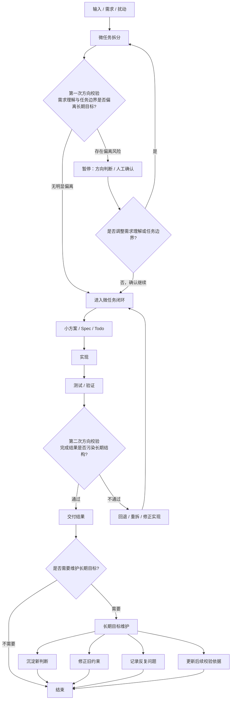

# AGE Lite 工作流

这是一个基于 **AGE（Attractor-Guided Evolution，吸引子引导演化）** 思想的极简项目协作框架。它不规定你的目录结构，不强求你写任务书，只做一件事：

**确保你的项目在每一次变动后，仍然朝着长期目标收敛。**

## 它是什么

一份 `AGENTS.md`，一条简单的工作流规则，让 AI 助手不再只是一个“高效的执行者”，而是一个“知道何时该停下来问你的协作者”。

- **微任务怎么做？** 你自己决定。直接改、写 spec、画脑图都行。
- **框架管什么？** 管方向。在任务开始前和结束后，用你的长期目标做双层校验。
- **结果怎么存？** 只有真正影响未来的经验和决策才被提醒沉淀，其他的用完即弃。

## 核心文件

| 文件             | 作用                                    | 给谁看  |
| :--------------- | :-------------------------------------- | :------ |
| `AGENTS.md`    | AI 操作协议，定义了整个工作流和停止条件 | AI      |
| `ATTRACTOR.md` | 项目的长期目标、核心原则、结构边界      | 你和 AI |
| `LOG.md`       | 沉淀下来的关键决策、反复问题和经验轨迹  | 你和 AI |

除此之外的一切文件和文件夹，都是“材料”，按你的习惯自由组织，无需索引。

## 快速开始

1. **定义你的吸引子**：在项目根目录创建 `ATTRACTOR.md`，写下这个项目“应该向哪里收敛”。不要写实现细节，只写方向和边界。
2. **让 AI 遵循协议**：将 `AGENTS.md` 放入项目根目录。如果你使用 ChatGPT/Codex 等，确保它可以读取此文件。
3. **开始工作**：像平时一样向 AI 提需求。AI 会自动：
   - 在复杂任务中创建临时文档管理自己，用完即弃。
   - 在任务理解后和交付前，用 `ATTRACTOR.md` 校验方向。
   - 当发现偏离风险时，**停下来问你**。
   - 在产生关键经验后，**提醒你**是否要沉淀到 `LOG.md`。

## 原则

- **框架不管理你，你管理目标。**
- **任何不产生长期影响的执行过程，都不值得归档。**
- **当 AI 替你决定“以后就这样了”时，它必须停下。**

## 何时扩展

项目变大后，如果需要，你可以自然地添加：

- `tasks/` 存放临时任务书
- `analysis/` 存放调研、竞品分析
- `decisions/` 拆分 `LOG.md` 中的决策记录

`AGENTS.md` 中的工作流不需要改变，它仍然有效。

## 工作流

